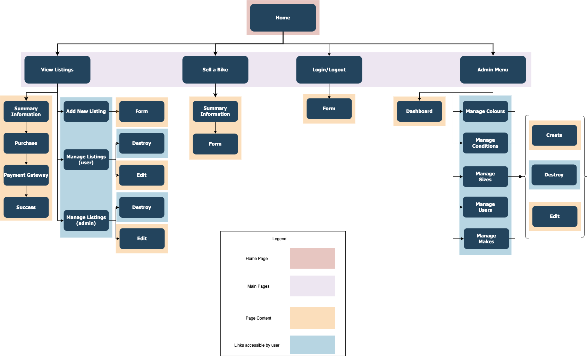
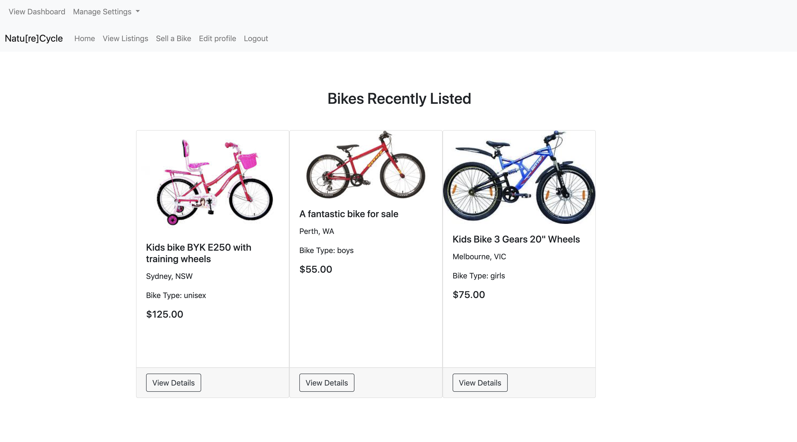
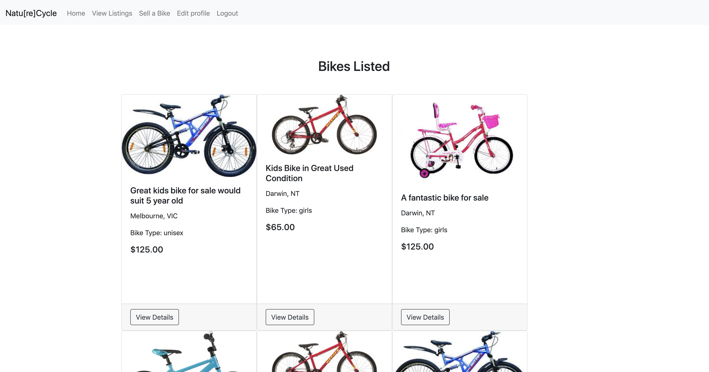
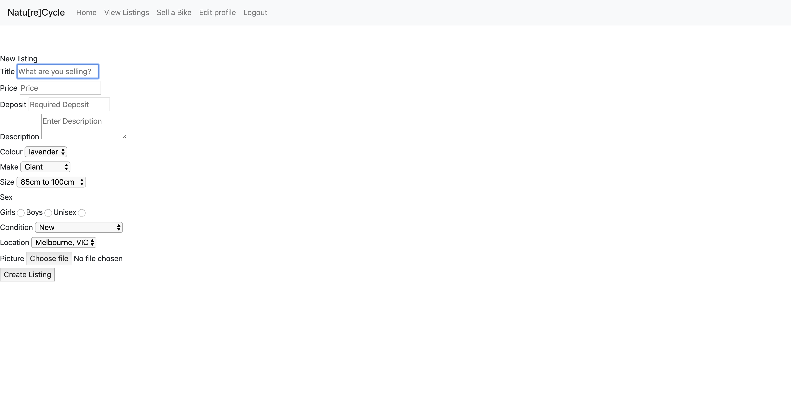
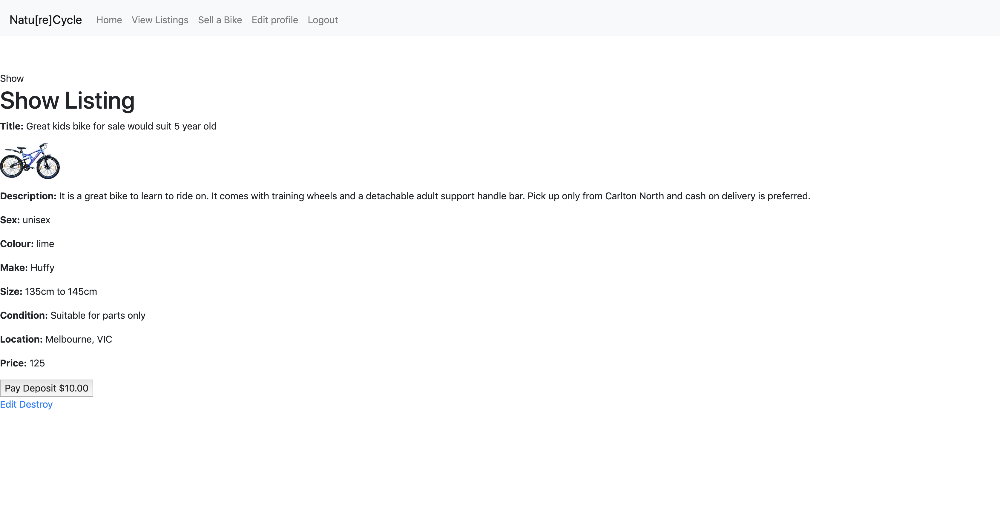
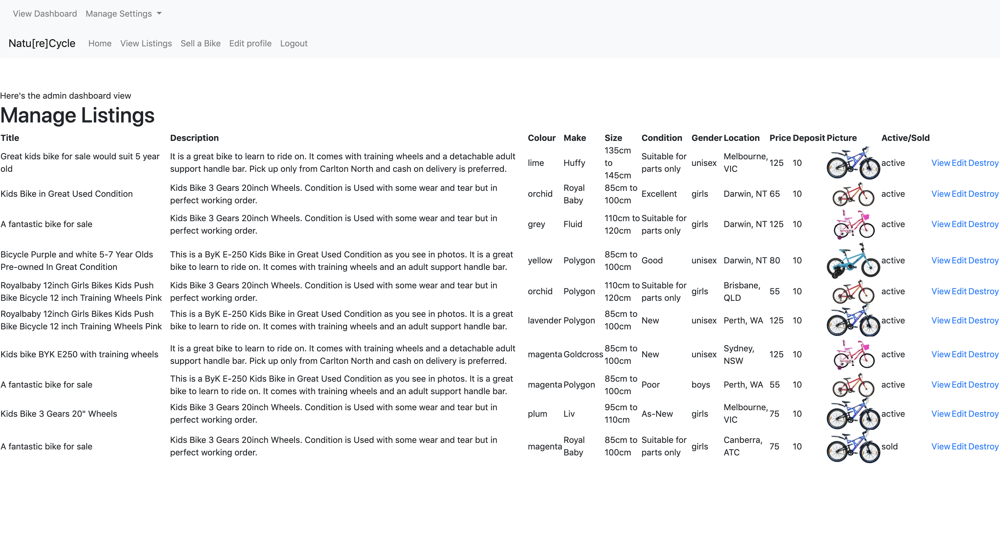
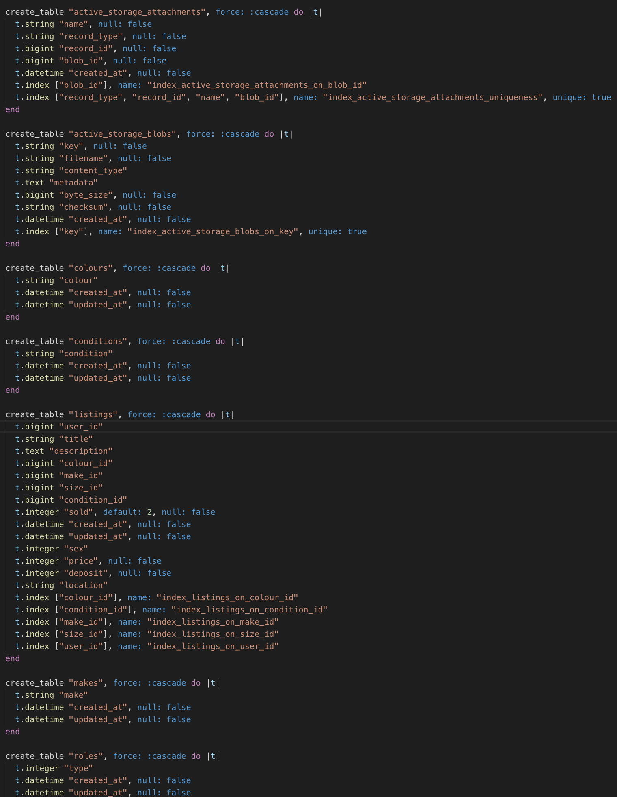

# README

## Natu[re]Cycle
NatureCycle is an application which allows users to list their discarded kids bikes for sale. It is a traditional marketplace-style application with user registration, image uploads and a Stripe payment gateway for processing of deposit payments.

## Identification of the problem you are trying to solve by building this particular marketplace app
Kids grow out of their clothes, shoes and uniforms, however, as a parent, the biggest lump-sum expense associated with our kids' growth would have to be the regular replacement of their bicycles. 
Have you ever walked down a suburban street and seen a discarded kids bike on the nature strip?  They're usually lying there for a good week before someone picks them up and this is where they deteriorate the most, making them difficult to re-home.

## Why is it a problem that needs solving?
This application has been developed to:
- make it easier to re-home unwanted bikes
- get kids onto the right sized bike, sooner
- get bikes off the nature strip
- makes bikes affordable to families in financial hardship
- reduce the incidence of discarded bikes in landfill.

## Accessing the Deployed App
[NatureCycle deployed using Heroku](https://sleepy-everglades-27880.herokuapp.com/)

## Accessing the GitHub repository
[GitHub - NatureCycle repository](https://github.com/Martyna-krawczyk/nature-cycle-marketplace)

## Description
### Purpose
The purpose of this application is to connect people with a bike to sell, to people looking to buy a bike - specifically, second hand children's bikes.

### Functionality
The application is accessible from any internet browser and is designed to be an easy-to-use application for even the non-tech-savviest of parents. 

### Features
The Application features include:
- User registration and profile management using (Devise plug-in)
- Ability to add a new listing with image upload (using Amazon Web Services S3) and future management of listing only if logged in user
- Page with current active listings viewable to visitors and logged-in users
- Detailed view of each listing only for logged-in users
- Ability to place a deposit on the bike to confirm purchase
- Credit Card payment of Deposits securely managed (using Stripe API)
- Once deposit paid, listing removed from active page
- Administration dashboard for a single administrator to manage all listings (using CanCanCan plug-in)

### Sitemap


### Screenshots







### Target Audience
This app is designed for parents and young people who either have used bikes to sell, or who would like to purchase a used bike. 

### Tech stack
- Ruby
- Ruby on Rails
- SCSS
- HTML
<br>
The app is deployed using Heroku, all images stores on AWS and Stripe payment gateway utilised.


## User Stories
- As a parent user (seller), I want to sell my kids used bikes so they aren't lying around in my garage when my kids can no longer ride them.
- As a parent user, I want to find bikes easily so that my kids have the right sized bike as they grow.
- As a parent user, I want my to be able to navigate the site easily.
- As a parent user(seller), I want to confirm the successful sale of my bike by collecting a deposit.
- As an admin user, I want to delete inappropriate listings that may be offensive.

## Wireframes


## ERD


## 	Explain the different high-level components (abstractions) in your app
1. Active Record is the Model which is responsible for connecting the rich objects of an application to the database tables without needing to type sql commands. Associations between the models means that models can connect to each other, allowing for less database code and easy storage and retrieval from the database - this is referred to as Object Relational Mapping (ORM).  An example of this is the command 'Listing.all' which, when utilised in methods within a controller, is transpiled and becomes 'select * from Listings'.  


2. This application utilises Active Storage to facilitate the uploading of files to Amazon Web Services (AWS), a cloud based storage service which connects the attachments to an Active Record object.  On creation of the application, Active Storage creates two tables ```called active_storage_blobs``` and ```active_storage_attachments```(a polymorphic table which stores the model's class name).  In order to declare an active storage service, it was necessary to update the config/environments/production.rb amd development.rb files with the name of the service, as well as add the service credentials to the storage.yaml file.  Declaring the 'has_one_attached :image' in the Listing model was also required.
```
config.active_storage.service = :amazon
```

3. Model Object Helpers within the forms have made it possible to very easily pass information from the form to the database, with the added ease of accessing the submitted information via params. By calling the form_with :model helper, I was able to bind the form to the object, without having to repeat the name of the edited object many times.

## Detail any third party services that your app will use
The application has been built with the help of the following ruby gems:
- Gems
  - Devise - Developed by Platformatech, Devise handles user authentication, with the inclusion of user tables, form helpers, controllers, views, mailers, and routes. It is simple to use and it is highly customizable.
  - CanCanCan - Developed by multiple contributors, CanCanCan is used in conjunction with Devise to manage multiple user roles and access using an authorisation library which restricts what resources a specific user is allowed to access. All permissions are defined in a single location (the Ability class) and not duplicated across controllers, views, and database queries. This application has three kinds of users - visitor, logged-in user (user) and admin user - each with their own access and Create, Read, Destroy, Update (CRUD) permissions.
  - Faker - Faker is an open source library for generating fake data such as names, email addresses and other types of data. In order to test the workings of an application, having data in the database is very important, however adding this information manually is very time consuming, therefore, this gem is very helpful in setting up the seeds file. In tis application, Faker was used only in seeding user accounts and generating colours.
  - Bootstrap - Bootstrap is a large collection of reuseable code written in HTML, CSS and Javascript, designed to enable designers to implement responsive websites quickly. Bootstrap was utilised in this application for implementation of the navigation bar and card-views for some basic styling across the site.
<br>
- Deployment - Heroku is a Platform as a service (PaaS) that enables developers to build, run, and operate applications entirely in the cloud.The application was deployed using Heroku using a free 'hobby' account. 
<br>
- Image Storage - Amazon Simple Storage Service (Amazon S3) is a secure  object storage service which stores any files in the cloud. Amazon S3 has been utilised to store and retrieve all attached listings images.
<br>
- Payment Gateway - Stripe is a cloud based payment solution which simplifies the collection of credit card payments on e-commerce and other websites. Stripe was selected to handle collection of the deposit at purchase within the application using their free testing API.

## Describe your projects models in terms of the relationships (active record associations) they have with each other
One user has many listings<br>
One colour has many listings<br>
One make has many listings<br>
One condition has many listings<br>
One size has many listings<br>
Listing belongs to user<br>
Listing belongs to colour<br>
Listing belongs to make<br>
Listing belongs to condition<br>
Listing belongs to size<br>

## Discuss the database relations to be implemented in your application
The application has five parent tables, being:
- Users
- Colours
- Makes
- Sizes
- Conditions<br>
The Listings table is the child table in this database as it contains columns with foreign keys from the parent tables above.
In order to have all of the required data for the implementation of the listings table, it was necessary to create the parent tables first before running a migration.

## Provide your database schema design
Strings are widely used in the database tables for attributes such as colour, condition, make and size. 
- Within the listings table, the below attributes were set to integer only in order to utilise them as enum.
  - sex (the gender suitability) - for use as a checkbox.
  - sold - to track active and sold listings by updating the integer when the success method runs (after payment has been made).
- Within the users table, a column called admin was added and set to a boolean in order to apply a true value against one admin user. This was a requirement of the CanCanCan gem.<br>
A screenshot of the schema is below.


## Describe the way tasks are allocated and tracked in your project
Throughout the course of the project, each task was tracked and managed using a trello board. It contained cards with due dates, checklists and attachments. The board can be accessed using this link:
[Trello Board](https://trello.com/b/qaFtFFnD/rails-marketplace)


trello_screenshot_two.png)
