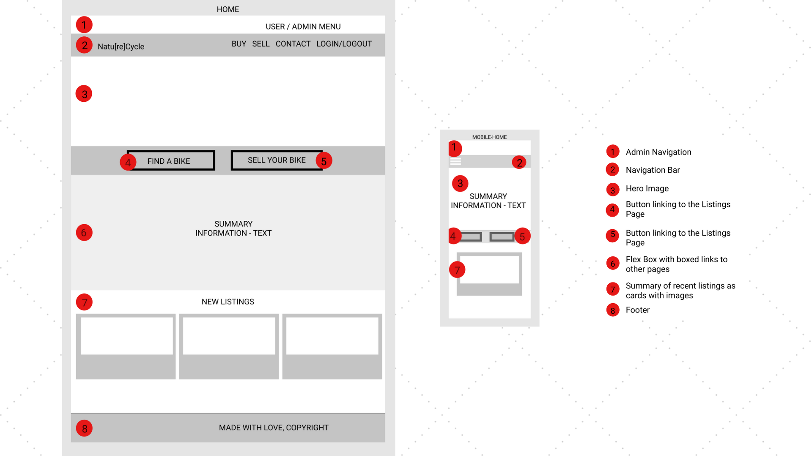
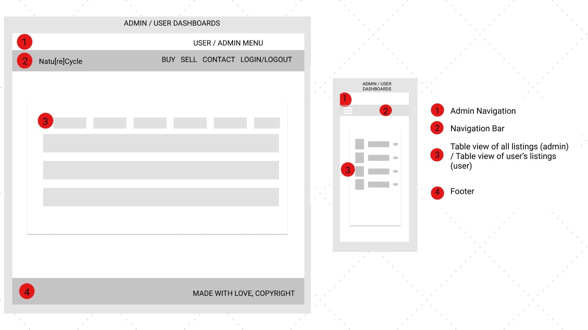
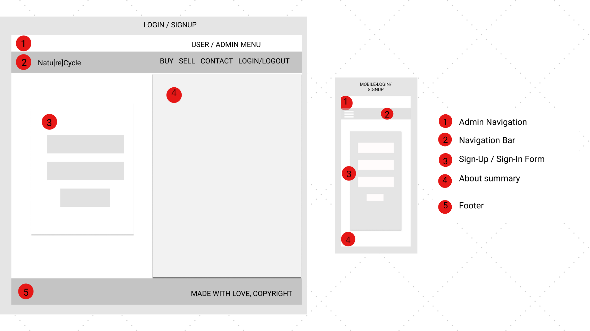
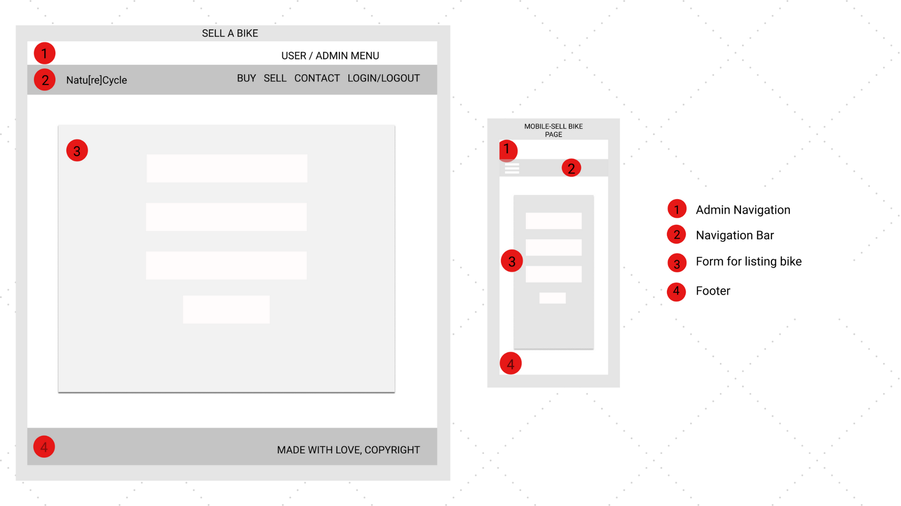
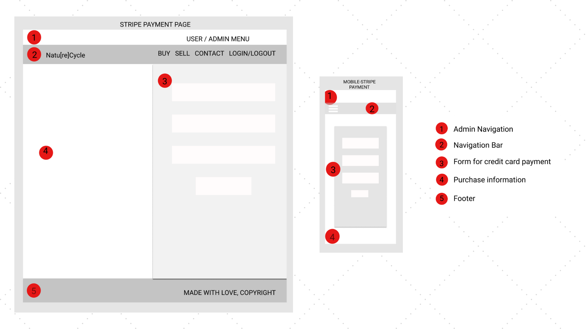
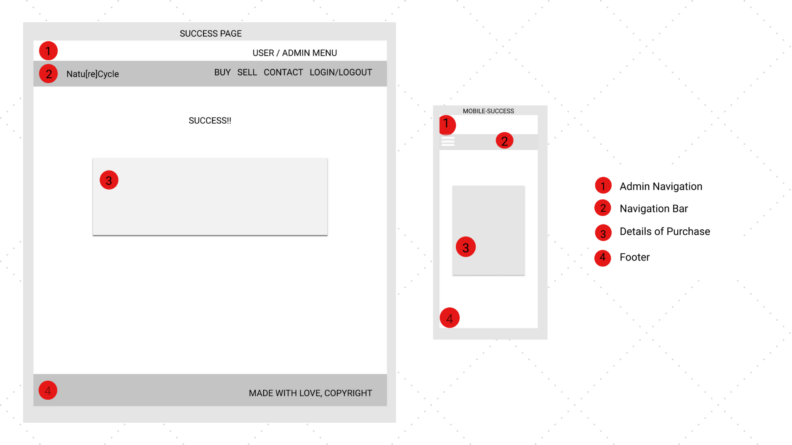
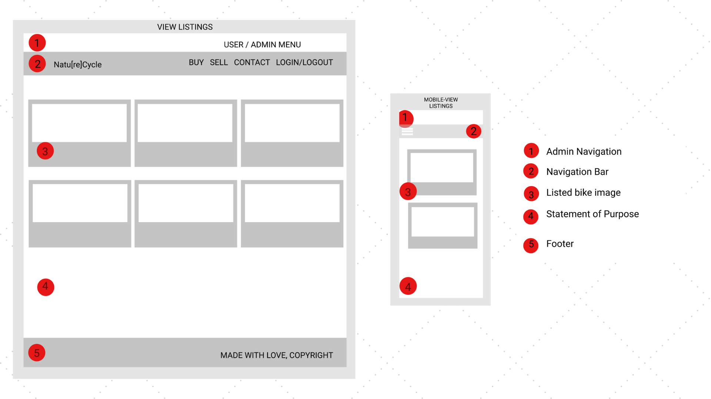
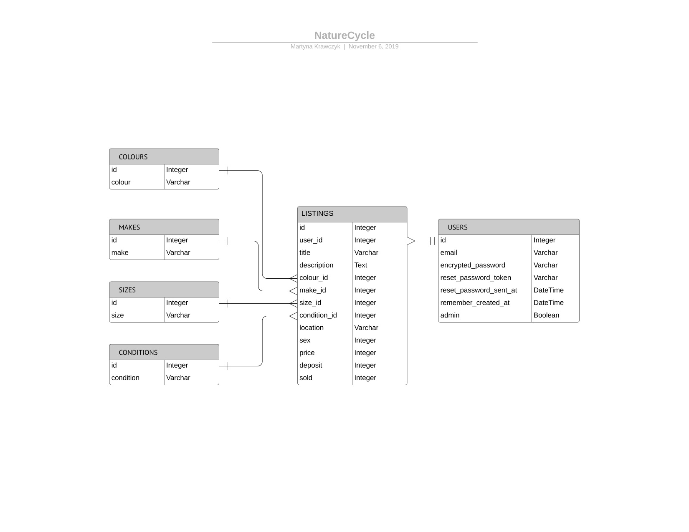
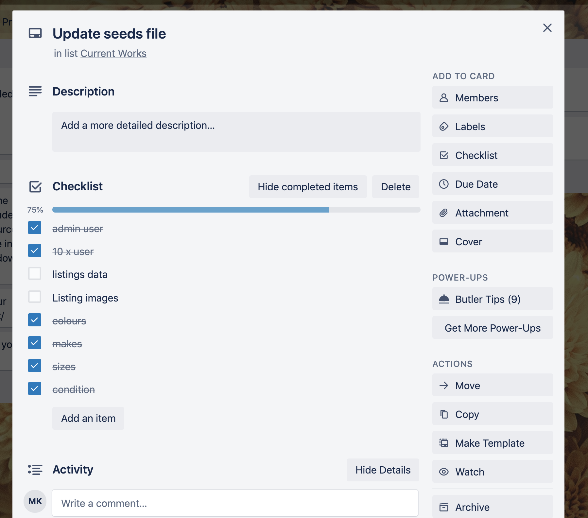

# README

## Natu[re]Cycle
NatureCycle is an application which allows users to list their discarded kids bikes for sale. It is a traditional marketplace-style application with user registration, image uploads and a Stripe payment gateway for processing of deposit payments.

## Identification of the problem you are trying to solve by building this particular marketplace app
Kids grow out of their clothes, shoes and uniforms, however, as a parent, the biggest lump-sum expense associated with our kids' growth would have to be the regular replacement of their bicycles. 
Have you ever walked down a suburban street and seen a discarded kids bike on the nature strip?  They're usually lying there for a good week before someone picks them up and this is where they deteriorate the most, making them difficult to re-home.

## Why is it a problem that needs solving?
This application has been developed to:
- make it easier to re-home unwanted bikes
- get kids onto the right sized bike, sooner
- get bikes off the nature strip
- makes bikes affordable to families in financial hardship
- reduce the incidence of discarded bikes in landfill.

## Accessing the Deployed App
[title](https://www.example.com)

## Accessing the GitHub repository
[GitHub - NatureCycle repository](https://github.com/Martyna-krawczyk/nature-cycle-marketplace)

## Description
### Purpose
The purpose of this application is to connect people with a bike to sell, to people looking to buy a bike - specifically, second hand children's bikes.

### Functionality
The application is accessible from any internet browser and is designed to be an easy-to-use application for even the non-tech-savviest of parents. 

### Features
The Application features include:
- User registration and profile management using (Devise plug-in)
- Ability to add a new listing with image upload (using Amazon Web Services S3) and future management of listing only if logged in user
- Page with current active listings viewable to visitors and logged-in users
- Detailed view of each listing only for logged-in users
- Ability to place a deposit on the bike to confirm purchase
- Credit Card payment of Deposits securely managed (using Stripe API)
- Once deposit paid, listing removed from active page
- Administration dashboard for a single administrator to manage all listings (using CanCanCan plug-in)

### Sitemap

### Screenshots

### Target Audience
This app is designed for parents and young people who either have used bikes to sell, or who would like to purchase a used bike. 

### Tech stack
- Ruby
- Ruby on Rails
- CSS
- HTML
The app is deployed using Heroku, all images stores on AWS and Stripe payment gateway utilised.

## User Stories
- As a parent user (seller), I want to sell my kids used bikes so they aren't lying around in my garage when my kids can no longer ride them.
- As a parent user, I want to find bikes easily so that my kids have the right sized bike as they grow.
- As a parent user, I want my to be able to navigate the site easily.
- As a parent user(seller), I want to confirm the successful sale of my bike by collecting a deposit.
- As an admin user, I want to delete inappropriate listings that may be offensive.

## Wireframes

## ERD

## 	Explain the different high-level components (abstractions) in your app
Active Record is the Model which is responsible for connecting the rich objects of an application, to the database tables without needing to type sql commands. It allows for there to be less database code and easy storage and retrieval from the database - this is referred to as Object Relational Mapping (ORM).

Product.all becomes select * from "Products"
2. Active Storage
3. Form Helpers - form_for

## Detail any third party services that your app will use
- Heroku
- Amazon Web Services (AWS) S3
- Stripe

## Describe your projects models in terms of the relationships (active record associations) they have with each other
One user has many listings

## Discuss the database relations to be implemented in your application
migrations
foreign keys
tables
x table has a foreign key of y
parent tables
child tables - has foreign key

## Provide your database schema design

data types and why certain data types chosen - Enum because ...
name = string
screenshot of schema

## Describe the way tasks are allocated and tracked in your project

